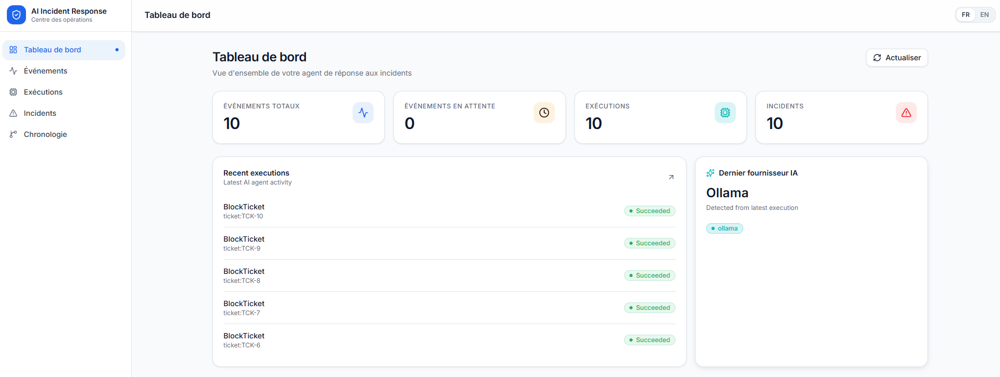
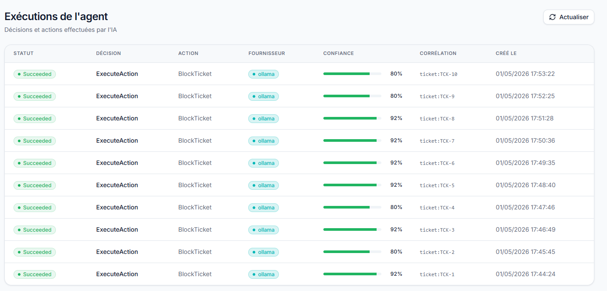
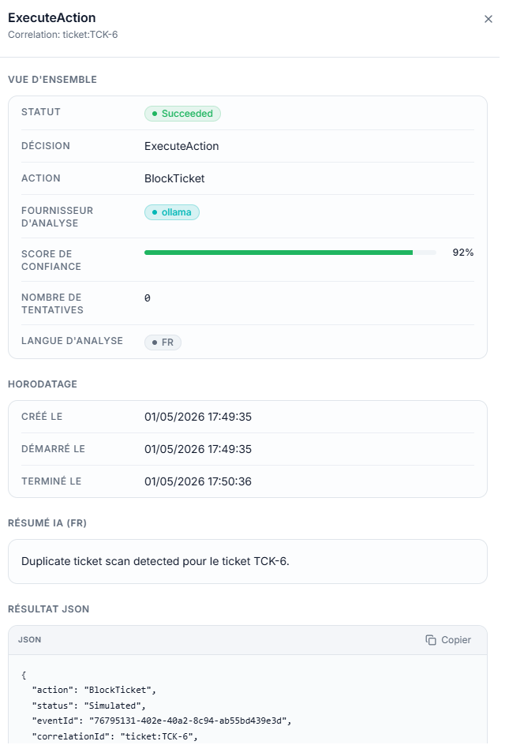
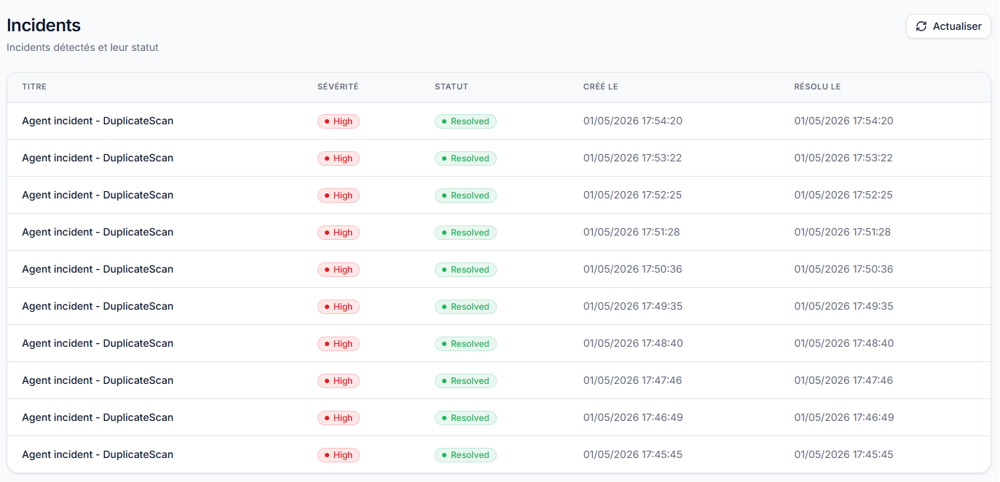
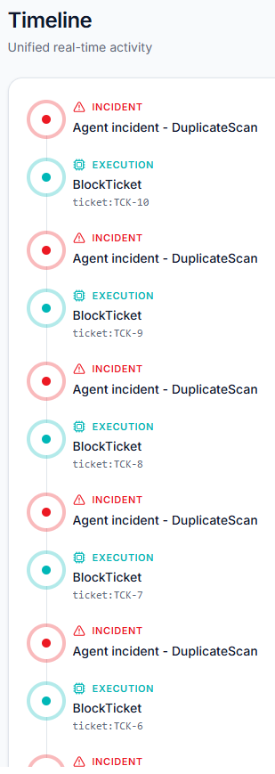

🧠 AI Incident Response Agent

Autonomous Operational AI Platform for real-time incident detection, decision, and automated response.

---

## 🚀 Vision

Build an autonomous AI agent capable of:

- Detecting critical events
- Understanding context (AI + business rules)
- Making decisions
- Executing actions automatically
- Observing outcomes
- Learning via feedback loop

👉 Goal: **automate operational workflows in a reliable, explainable and controlled way**

---

## 🧩 Architecture

```text
Event → Detection → Analysis → Decision → Action → Feedback → Memory
Core principles
AI is not the decision maker
Business rules & policies control actions
Full auditability & traceability
Autonomy levels (observe → suggest → act → escalate)
🏗️ Project Structure
src/
├─ Api              → HTTP endpoints + Swagger
├─ Worker           → background processing (agent execution)
├─ Domain           → core entities (DDD)
├─ Application      → orchestrator + contracts
├─ Infrastructure   → EF Core, persistence, integrations
├─ Contracts        → DTOs

ops-center/         → React/TanStack dashboard (Ops UI)

tests/
├─ UnitTests
├─ IntegrationTests
⚙️ Tech Stack
.NET 8
ASP.NET Core
PostgreSQL
Entity Framework Core
Background Worker
Ollama (local LLM) 🔥
Swagger
Tailwind / React (Ops Center UI)
🧠 Core Components
Component	Role
Event Ingestion	Capture system events
Orchestrator	Coordinate full agent flow
AI Analyzer	Understand context (Ollama)
Decision Engine	Apply business logic
Policy Engine	Enforce safety rules
Action Executor	Execute actions
Memory System	Context persistence
Feedback Loop	Improve behavior
🔐 Safety & Control
AI is always bounded
Policy engine controls execution
Idempotency prevents duplicate actions
agent_action_locks for concurrency safety
Full execution logs & traceability
🌍 AI Capabilities
Local AI via Ollama
Deterministic JSON output
Guardrails + validation
Retry + fallback (stub analyzer)
Bilingual summaries:
AnalysisSummaryFr
AnalysisSummaryEn
Language-aware processing (lang end-to-end)
🖥️ Ops Center (UI)

A modern SaaS-style dashboard to monitor the agent:

Dashboard KPIs
Events list
Executions tracking
Incidents monitoring
Timeline view
Execution details panel

👉 Located in: ops-center/

🚀 Getting Started
1. Run API
dotnet run --project src/AiIncidentResponseAgent.Api
2. Run Worker
dotnet run --project src/AiIncidentResponseAgent.Worker
3. Run Ops Center
cd ops-center
npm install
npm run dev
🤖 Ollama Setup

Install Ollama and pull a model:

ollama pull llama3
ollama run llama3

Default endpoint:

http://localhost:11434
🧪 Load Testing

Example PowerShell script:

for ($i = 1; $i -le 100; $i++) {
    $body = @{
        type = 1
        source = "load-test"
        payloadJson = "{""ticketId"":""TCK-$i""}"
        correlationId = "ticket:TCK-$i"
        lang = "fr"
    } | ConvertTo-Json

    Invoke-RestMethod -Uri "http://localhost:5027/api/agent-events" `
        -Method Post `
        -Body $body `
        -ContentType "application/json"
}
📊 Current Status
✅ Implemented
Full backend architecture (DDD + clean layering)
Event ingestion API
Worker polling & processing
Orchestrator (end-to-end flow)
Ollama AI Analyzer (local)
Decision + Policy engines
Action execution with safety locks
Execution & incident tracking
Bilingual AI summaries
Ops Center dashboard (read-only)
🚧 Next Steps
CRUD operations (incidents / executions)
Manual override / approval UI
SignalR real-time updates
Metrics & observability
External integrations (real actions)
Authentication / RBAC
Multi-tenant support
🎯 Goal

Build a production-grade autonomous agent platform capable of:

Acting without human intervention
Explaining decisions
Remaining safe and controlled
Scaling to real operational workloads

## 📸 Screenshots

### 🧭 Dashboard

Overview of the agent activity with key metrics:
- Total events
- Executions
- Incidents
- Pending processing



---

### ⚡ Agent Executions

Track all agent executions:
- Status (Succeeded / Failed / Skipped)
- Decision & Action
- AI Provider (Ollama / Stub)
- Confidence Score
- Correlation ID



---

### 🔍 Execution Details

Detailed view of a single execution:
- Decision & action taken
- AI summary (FR/EN)
- Confidence score
- Result JSON (formatted)
- Execution timestamps



---

### 🚨 Incidents

Monitor detected incidents:
- Title & description
- Severity & status
- Lifecycle (created → resolved)



---

### 🕒 Timeline

Chronological view of the agent activity:
- Events
- Executions
- Incidents



👨 Author

Rachid Bariz