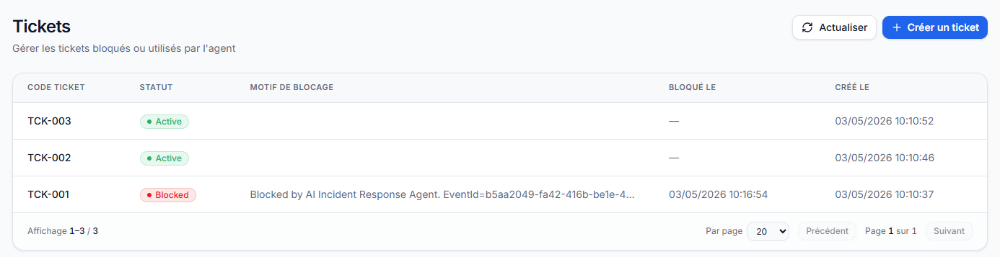

🧠 AI Incident Response Agent

Autonomous Operational AI Platform for real-time incident detection, decision, approval, action execution, observability and automated response.

---

## 🚀 Vision

Build a controlled autonomous AI agent capable of:

- Detecting critical operational events
- Understanding context using AI + business rules
- Making deterministic decisions
- Executing safe actions
- Requesting human approval when needed
- Observing outcomes
- Retrying failed actions with backoff
- Providing full auditability and traceability

Goal: **automate operational workflows in a reliable, explainable and controlled way**.

---

## 🧩 Architecture

```text
Event → Detection → Analysis → Decision → Policy → Action → Feedback → Memory → Realtime → Metrics
Core principles
AI is not the final decision maker
Business rules and policies control execution
Critical actions can require manual approval
Full auditability and traceability
Idempotency and action locks prevent duplicate actions
Observability is built in: logs, metrics, health checks

🏗️ Project Structure
src/
├─ AiIncidentResponseAgent.Api              → HTTP API, Swagger, Auth, SignalR, Health Checks
├─ AiIncidentResponseAgent.Worker           → Background processing and retry execution
├─ AiIncidentResponseAgent.Domain           → Core entities and domain rules
├─ AiIncidentResponseAgent.Application      → Orchestrator, contracts, policies, services
├─ AiIncidentResponseAgent.Infrastructure   → EF Core, PostgreSQL, Ollama, repositories, integrations
├─ AiIncidentResponseAgent.Contracts        → DTOs and API contracts

ops-center/                                

→ React/TanStack Ops Center UI

tests/
├─ AiIncidentResponseAgent.UnitTests
├─ AiIncidentResponseAgent.IntegrationTests

⚙️ Tech Stack
.NET 8
ASP.NET Core Web API
PostgreSQL
Entity Framework Core
Background Worker
SignalR realtime
JWT Auth + RBAC
Ollama local LLM
Swagger / OpenAPI
React / TanStack / Tailwind CSS
Health Checks (ASP.NET Core)
Structured logging (ILogger)

🧠 Core Components
Component	Role
Event Ingestion	Capture incoming operational events
Worker	Process unhandled events asynchronously
Orchestrator	Coordinate the full agent lifecycle
AI Analyzer	Analyze events using Ollama
Decision Engine	Apply deterministic business decisions
Policy Engine	Enforce safety rules
Manual Approval	Human approve/reject workflow
Action Executor	Execute approved or automatic actions
Ticketing Module	Local real ticket blocking module
Memory System	Persist context across executions
Feedback Loop	Update memory and execution state
SignalR Realtime	Push live updates to Ops Center
Metrics	Business and technical monitoring
Health Checks	API, DB and Ollama readiness

🔐 Safety & Control
AI is bounded and never executes actions directly
Deterministic policies control action execution
agent_action_locks prevent duplicate successful actions
Manual approval is supported for sensitive decisions
Retry strategy uses backoff and does not re-run AI analysis
Full execution logs and incident tracking are persisted

🌍 AI Capabilities
Local AI via Ollama
Strict JSON response validation
Guardrails and fallback stub analyzer
Retry/fallback when AI output is invalid
Bilingual AI summaries:
AnalysisSummaryFr
AnalysisSummaryEn
lang is carried end-to-end from event ingestion to AI analysis

🖥️ Ops Center

The ops-center/ folder contains a premium SaaS-style dashboard.

Current UI capabilities:

Dashboard KPIs
Technical metrics
Events list
Executions tracking
Execution details
Incidents monitoring
Incident edit / resolve / reopen / archive
Tickets page
Manual approve / reject workflow
Timeline view
SignalR realtime updates
Login / logout
Role-based UI:
Viewer
Operator
Admin
🔑 Auth / RBAC

Development users:

Username	Password	Role
admin	Admin123!	Admin
operator	Operator123!	Operator
viewer	Viewer123!	Viewer

Roles:

Role	Permissions
Viewer	Read-only access
Operator	Approve/reject executions, manage tickets, manage incidents
Admin	Full access including archive/delete actions

🚀 Getting Started
1. Run PostgreSQL

Make sure PostgreSQL is running and the connection string is configured in:

appsettings.Development.json
2. Apply migrations
dotnet ef database update \
  --project src/AiIncidentResponseAgent.Infrastructure \
  --startup-project src/AiIncidentResponseAgent.Api \
  --context AgentDbContext
3. Run API
dotnet run --project src/AiIncidentResponseAgent.Api

Default local API:

http://localhost:5027
4. Run Worker
dotnet run --project src/AiIncidentResponseAgent.Worker
5. Run Ops Center
cd ops-center
npm install
npm run dev

🤖 Ollama Setup

Install Ollama and pull a local model:

ollama pull llama3
ollama run llama3

Default Ollama endpoint:

http://localhost:11434

Health check:

GET /health/ready

🧪 Load Testing

Example PowerShell script:

for ($i = 1; $i -le 100; $i++) {
    $body = @{
        type = 1
        source = "load-test"
        payloadJson = "{""ticketId"":""TCK-$i""}"
        correlationId = "ticket:TCK-$i"
        lang = "fr"
    } | ConvertTo-Json

    Invoke-RestMethod -Uri "http://localhost:5027/api/agent-events" `
        -Method Post `
        -Body $body `
        -ContentType "application/json"
}

📊 Metrics
Business metrics
GET /api/metrics/overview

Includes:

Total events
Pending events
Total executions
Succeeded / failed / skipped executions
Pending approvals
Incidents
Tickets
Success rate
Failure rate
Technical metrics
GET /api/metrics/technical

Includes:

Average execution duration
Max execution duration
Total retries
Retry scheduled executions
AI provider usage
Action usage
Status distribution

❤️ Health Checks

The API exposes health endpoints for operational monitoring:

GET /health
GET /health/live
GET /health/ready

Readiness checks:

PostgreSQL connectivity
Ollama availability

📊 Current Status

✅ Implemented
Clean architecture / DDD-style layering
PostgreSQL persistence
Event ingestion API
Worker polling
Agent orchestrator
Ollama AI analyzer
JSON validation and fallback analyzer
Decision engine
Policy engine
Action executor
Local ticketing module with real persisted BlockTicket
Manual approval / reject workflow
Retry strategy with backoff
Action locks after successful execution
Incident CRUD
JWT authentication
RBAC roles: Viewer, Operator, Admin
SignalR realtime notifications
Metrics dashboard backend
Technical metrics backend
Health checks
Structured logging
Ops Center UI

🚧 Current Limitations / Future Work
Real external BlockTicket API integration is not implemented yet; current implementation uses a local Ticketing module
Production observability can be improved with OpenTelemetry, traces and external log sinks
Detailed audit trail for all user/operator actions is not implemented yet
Automated tests are still limited / to be completed
Docker Compose demo packaging is not completed yet
Security hardening can be improved with refresh tokens, SignalR JWT auth, stronger internal API protection and secret management

📸 Screenshots
🧭 Dashboard

Overview of the agent activity with key metrics.


⚡ Agent Executions

Track agent executions, statuses, decisions, actions, AI provider and confidence score.


🔍 Execution Details

Detailed view of a single execution with AI summary, result JSON, retry information and timestamps.


🚨 Incidents

Monitor incidents, severity, status and lifecycle.


🎟️ Tickets

Track local tickets and BlockTicket execution results.


🕒 Timeline

Chronological view of events, executions and incidents.


🎯 Goal

Build a production-grade autonomous agent platform capable of:

Acting without human intervention when safe
Requesting approval when required
Explaining decisions
Remaining controlled and auditable
Scaling to real operational workloads


## Docker Compose Demo

Run the full local demo with PostgreSQL, API, Worker and Ops Center:

ollama run llama3
docker compose --env-file .env.docker up --build

Services:

API: http://localhost:5027
Swagger: http://localhost:5027/swagger
Ops Center: http://localhost:5173
Health: http://localhost:5027/health/ready

Ollama runs on the host machine and is accessed from containers through:

http://host.docker.internal:11434


## Secrets Management

For local development, sensitive values are stored using .NET User Secrets.

API:

dotnet user-secrets init --project src/AiIncidentResponseAgent.Api
dotnet user-secrets set "ConnectionStrings:DefaultConnection" "Host=localhost;Port=5432;Database=ai_incident_response;Username=postgres;Password=postgres" --project src/AiIncidentResponseAgent.Api
dotnet user-secrets set "Jwt:Secret" "DEV_SECRET_CHANGE_ME_123456789_32_CHARS_MIN" --project src/AiIncidentResponseAgent.Api
dotnet user-secrets set "InternalApiKey:ApiKey" "DEV_INTERNAL_REALTIME_KEY_123456" --project src/AiIncidentResponseAgent.Api

Worker:

dotnet user-secrets init --project src/AiIncidentResponseAgent.Worker
dotnet user-secrets set "ConnectionStrings:DefaultConnection" "Host=localhost;Port=5432;Database=ai_incident_response;Username=postgres;Password=postgres" --project src/AiIncidentResponseAgent.Worker
dotnet user-secrets set "InternalApiKey:ApiKey" "DEV_INTERNAL_REALTIME_KEY_123456" --project src/AiIncidentResponseAgent.Worker

## 🚧 Ongoing Development

The project is actively evolving toward a production-grade autonomous agent platform.

The following improvements are planned or in progress:

- 🔌 Real external BlockTicket API integration (replace or extend local ticket module)
- 📡 OpenTelemetry integration (distributed tracing, observability stack)
- 🐳 Docker Compose finalization and production-ready setup
- 🧪 Extended automated tests (retry flows, approvals, RBAC, audit logs)
- 📜 Audit Logs UI in Ops Center
- 📸 Final screenshots and demo scenarios with clean dataset

These enhancements will further strengthen reliability, observability and real-world readiness.


👨 Author

Rachid Bariz